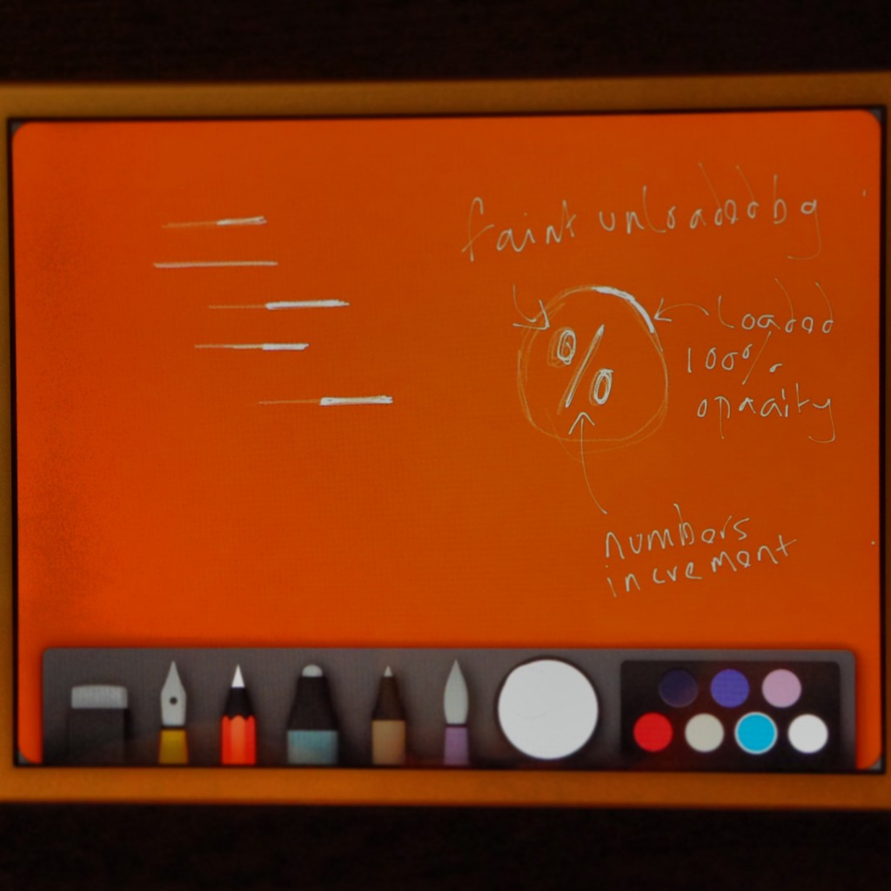

I decided to do a little sketching on my iPad mini on the way in to work one day...after getting frustrated with not being able to get some code to function.

This is what I drew: _This was drawn on a train in to London, please excuse the scruffiness_

What is this all about? I wanted to get my mind off the other work so I looked at creating a minimal preloader, using only CSS, HTML and little jQuery. I started with taking on the traditional "straight line" preloader and playing with the thickness of lines and their opacity. This was looking great, but I wanted to create something a little more exciting for the visitor - who wants to wait to view a site anyway? I wanted to make that wait a little more bearable.

I looked at creating a circular pre-loader, yes this is traditional again, but making this in CSS-only would prove to be a challenge and something that I know that could be re-used in an upcoming project.


_The final design made in Photoshop after importing the image from the iPad so I could get that red/orange background color_

Lets get started, shall we:

**All credit goes to this [website](http://blakek.us/labs/jquery/css3-pie-graph-timer "css pie graph and timer") which I used to make all of the animation.**

The html
```html
<div class="container">
		<div class="loader">
			<div class="loader-bg">
				<div class="text"></div>
			</div>
			<div class="spiner-holder-one animate-0-25-a">
				<div class="spiner-holder-two animate-0-25-b">
					<div class="loader-spiner" </div>
				</div>
			</div>
			<div class="spiner-holder-one animate-25-50-a">
				<div class="spiner-holder-two animate-25-50-b">
					<div class="loader-spiner"></div>
				</div>
			</div>
			<div class="spiner-holder-one animate-50-75-a">
				<div class="spiner-holder-two animate-50-75-b">
					<div class="loader-spiner"></div>
				</div>
			</div>
			<div class="spiner-holder-one animate-75-100-a">
				<div class="spiner-holder-two animate-75-100-b">
					<div class="loader-spiner"></div>
				</div>
			</div>
		</div>
	</div>
```

The circle is split in to four squares, I'm not totally sure why but I'm guessing it's to do with the math and transformations occurring in the background when the jQuery rotates the inner, loading, circle - I'm experimenting with this and getting some very funky shapes!

The CSS
```css
.text {
			color: rgba(255, 255, 255, 1);
			font-size: 6em;
			padding-top: 30%;
			text-align: center;
			font-weight: lighter;
		}
		.loader {
			margin: 50px auto 0;
			position: relative;
			width: 300px;
			height: 300px;
			-webkit-user-select: none;
			-moz-user-select: none;
			-ms-user-select: none;
			user-select: none;
			-webkit-box-sizing: border-box;
			-moz-box-sizing: border-box;
			-ms-box-sizing: border-box;
			box-sizing: border-box;
		}
		.loader-bg {
			width: 100%;
			height: 100%;
			border-radius: 50%;
			border: 2px solid rgba(255, 255, 255, 0.2);
			-webkit-box-sizing: border-box;
			-moz-box-sizing: border-box;
			-ms-box-sizing: border-box;
			box-sizing: border-box;
		}
		.spiner-holder-one {
			position: absolute;
			top:0;
			left:0;
			overflow: hidden;
			width: 50%;
			height: 50%;
			background: transparent;
			-webkit-box-sizing: border-box;
			-moz-box-sizing: border-box;
			-ms-box-sizing: border-box;
			box-sizing: border-box;
		}
		.spiner-holder-two {
			position: absolute;
			top:0;
			left:0;
			overflow: hidden;
			width: 100%;
			height: 100%;
			background: transparent;
			-webkit-box-sizing: border-box;
			-moz-box-sizing: border-box;
			-ms-box-sizing: border-box;
			box-sizing: border-box;
		}
		.loader-spiner {
			width: 200%;
			height: 200%;
			border-radius: 50%;
			border: 2px solid rgba(255, 255, 255, 0.9);
			-webkit-box-sizing: border-box;
			-moz-box-sizing: border-box;
			-ms-box-sizing: border-box;
			box-sizing: border-box;
		}
		.animate-0-25-a {
			-webkit-transform: rotate(90deg);
			-moz-transform: rotate(90deg);
			-o-transform: rotate(90deg);
			-ms-transform: rotate(90deg);
			transform: rotate(90deg);
			-webkit-transform-origin: 100% 100%;
			-moz-transform-origin: 100% 100%;
			-o-transform-origin: 100% 100%;
			-ms-transform-origin: 100% 100%;
			transform-origin: 100% 100%;
		}
		.animate-0-25-b {
			-webkit-transform: rotate(-90deg);
			-moz-transform: rotate(-90deg);
			-o-transform: rotate(-90deg);
			-ms-transform: rotate(-90deg);
			transform: rotate(-90deg);
			-webkit-transform-origin: 100% 100%;
			-moz-transform-origin: 100% 100%;
			-o-transform-origin: 100% 100%;
			-ms-transform-origin: 100% 100%;
			transform-origin: 100% 100%;
		}
		.animate-25-50-a {
			-webkit-transform: rotate(180deg);
			-moz-transform: rotate(180deg);
			-o-transform: rotate(180deg);
			-ms-transform: rotate(180deg);
			transform: rotate(180deg);
			-webkit-transform-origin: 100% 100%;
			-moz-transform-origin: 100% 100%;
			-o-transform-origin: 100% 100%;
			-ms-transform-origin: 100% 100%;
			transform-origin: 100% 100%;
		}
		.animate-25-50-b {
			-webkit-transform: rotate(-90deg);
			-moz-transform: rotate(-90deg);
			-o-transform: rotate(-90deg);
			-ms-transform: rotate(-90deg);
			transform: rotate(-90deg);
			-webkit-transform-origin: 100% 100%;
			-moz-transform-origin: 100% 100%;
			-o-transform-origin: 100% 100%;
			-ms-transform-origin: 100% 100%;
			transform-origin: 100% 100%;
		}
		.animate-50-75-a {
			-webkit-transform: rotate(270deg);
			-moz-transform: rotate(270deg);
			-o-transform: rotate(270deg);
			-ms-transform: rotate(270deg);
			transform: rotate(270deg);
			-webkit-transform-origin: 100% 100%;
			-moz-transform-origin: 100% 100%;
			-o-transform-origin: 100% 100%;
			-ms-transform-origin: 100% 100%;
			transform-origin: 100% 100%;
		}
		.animate-50-75-b {
			-webkit-transform: rotate(-90deg);
			-moz-transform: rotate(-90deg);
			-o-transform: rotate(-90deg);
			-ms-transform: rotate(-90deg);
			transform: rotate(-90deg);
			-webkit-transform-origin:100% 100%;
			-moz-transform-origin:100% 100%;
			-o-transform-origin:100% 100%;
			-ms-transform-origin:100% 100%;
			transform-origin:100% 100%;
		}
		.animate-75-100-a {
			-webkit-transform: rotate(0deg);
			-moz-transform: rotate(0deg);
			-o-transform: rotate(0deg);
			-ms-transform: rotate(0deg);
			transform: rotate(0deg);
			-webkit-transform-origin: 100% 100%;
			-moz-transform-origin: 100% 100%;
			-o-transform-origin: 100% 100%;
			-ms-transform-origin: 100% 100%;
			transform-origin: 100% 100%;
		}
		.animate-75-100-b {
			-webkit-transform: rotate(-90deg);
			-moz-transform: rotate(-90deg);
			-o-transform: rotate(-90deg);
			-ms-transform: rotate(-90deg);
			transform: rotate(-90deg);
			-webkit-transform-origin: 100% 100%;
			-moz-transform-origin: 100% 100%;
			-o-transform-origin: 100% 100%;
			-ms-transform-origin: 100% 100%;
			transform-origin: 100% 100%;
		}
```

WOW - where do I even start with this lot. I understand all of this but explaining it here is going to be difficult!

The jQuery
```js
<script>
		function renderProgress(progress) {
		    progress = Math.floor(progress);

		    if(progress<25){
		        var angle = -90 + (progress/100)\*360;
		        $(".animate-0-25-b").css("transform","rotate("+angle+"deg)");
		    }
		    else if(progress>=25 && progress<50){
		        var angle = -90 + ((progress-25)/100)\*360;
		        $(".animate-0-25-b").css("transform","rotate(0deg)");
		        $(".animate-25-50-b").css("transform","rotate("+angle+"deg)");
		    }
		    else if(progress>=50 && progress<75){
		        var angle = -90 + ((progress-50)/100)\*360;
		        $(".animate-25-50-b, .animate-0-25-b").css("transform","rotate(0deg)");
		        $(".animate-50-75-b").css("transform","rotate("+angle+"deg)");
		    }
		    else if(progress>=75 && progress<=100){
		        var angle = -90 + ((progress-75)/100)\*360;
		        $(".animate-50-75-b, .animate-25-50-b, .animate-0-25-b").css("transform","rotate(0deg)");
		        $(".animate-75-100-b").css("transform","rotate("+angle+"deg)");
		    }
		    if(progress==100){
		    }
		    $(".text").html(progress+"%");
		}

		function clearProgress() {
		    $(".animate-75-100-b, .animate-50-75-b, .animate-25-50-b, .animate-0-25-b").css("transform","rotate(90deg)");
		}

		var i 			=0;
		var times 		= 0;

		var interval 	= setInterval(function (){
            i++;
            times += 1;
            if( times >= 100 ) {
                // clearProgress();
                width = '4px';
                clearInterval(interval);
                $('.text').animate({
                	opacity : 0.5
                }, 'slow');
            	$('.loader-spiner').animate({
            		borderLeftWidth: width,
					borderTopWidth: width,
					borderRightWidth: width,
					borderBottomWidth: width
				}, 100 );
            }
            renderProgress(i);
		},60);
</script>
```

Here it is in action via instagram: video.instagram, img.instagram {width: 100% !important; height: auto !important;}
_#webdev #html #css #jquery Circular loading animation. Started from an iPad idea. by @[scriptedpixels](http://instagram.com/scriptedpixels)_

and via [JSFiddle](http://jsfiddle.net/scriptedpixels/LKBnx/light/):

```html
<iframe width="100%" height="600" src="http://jsfiddle.net/scriptedpixels/LKBnx/embedded/result,js,html,css/" allowfullscreen="allowfullscreen" frameborder="0"></iframe>
```

Just to get this out the door I'm going to end this post here. I'll figure out a way to annotate all the code in a nice legible and logical way as I'd like to highlight what I've done.

Please, ask questions, highlight issues, complain or provide some constructive feedback below - everything is welcome!
