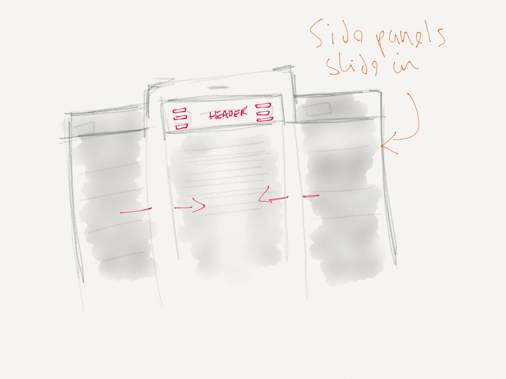
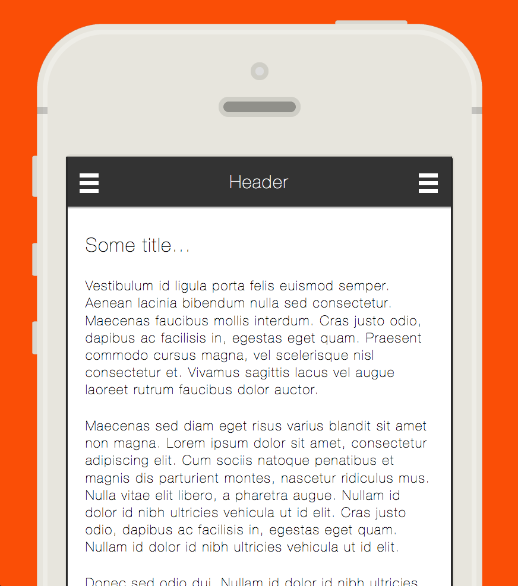

Whilst working at my current contract, at [LuxDeco](http://www.luxdeco.com "LuxDeco"), I was tasked with creating a, mobile optimised, Magento theme where the design featured two slide-out/in info panels. These were to act similar to the slide out/in panels featured in the new Facebook mobile-app where the user is able to view a hidden panel that's hidden off the left and right hand side of the main content page.

Here's a sketch of what I was looking to create: 

And here's the final version: 

Annnd here's a working [demo](http://scriptedpixels.co.uk/playground/doubleNavSliding.html "Double slide out/in navigation").

Before I even started to figure out how it was going to work I thought I'd start looking for a plugin, or tutorials, as this design is seen on a fair few websites now, especially as more and more sites are being optimised for smaller screens. I looked for plugins/tutorials that offered near-similar functionality. I assumed it would be a short search **but** what I found was a bunch of 'plugins/tutorials' that had 'issues'. These were issues that I found after implementing them and wasted an hour or so on each plugin/tutorial.

The main issue I had was that some of the menu's didn't think of what would happen if a menu was slightly longer than the main content/page. The menu's would then get cut off at the bottom. There was no way of seeing the rest of the menu with either scrolling or zooming out. This brought me on to the next **big issue!**. I found they had disabled the users ability to 'pinch-to-zoom'!

This is a big **NO NO** for mobile sites; why takeaway a, now everyone knows how to do it, natural gesture from the user? It's not a nice user experience and if this was going to be used on a e-commerce store, like I was planning to use it, I didn't want visitors to not have the ability to zoom in to product images.

After all the searching and testing I did come across one very useful resource, this is what I've based my version on, from [Smashing Magazine.](http://coding.smashingmagazine.com/2013/01/15/off-canvas-navigation-for-responsive-website/ "Off canvas navigation") Their [final demo](http://dbushell.github.io/Responsive-Off-Canvas-Menu/step4.html "final demo(off canvas)") sold it for me, I knew I could manipulate it in to how I wanted it to function with ease :)

Now, the bit you're looking for; the code!

THE HTML:

    

        

            <!-- Page header -->
            <header id="pageHeader" role="banner">
                

                    <h1 class="block-title">Header</h1>
                    <a class="nav-btn" id="nav-open-btn" href="#nav" data-nav="js-nav">Menu </a>
                    <a class="nav-btn btn2" id="nav-open-btn2" href="#nav2" data-nav="js-nav2">Menu</a>
                

            </header>

            <!-- Left hand naviation -->
            <nav id="nav" role="navigation" class="navigation">
                

                    <h2 class="block-title">Main Navigation</h2>
                    <ul>
                        <li class="is-active">
                            <a href="#">Chapter 1</a>
                        </li><!--
                     --><li>
                            <a href="#">Chapter 2</a>
                        </li><!--
                     --><li>
                            <a href="#">Chapter 3</a>
                        </li><!--
                     --><li>
                            <a href="#">Chapter 4</a>
                        </li><!--
                     --><li>
                            <a href="#">Chapter 5</a>
                        </li><!--
                     --><li>
                            <a href="#">Chapter 6</a>
                        </li><!--
                     --><li>
                            <a href="#">Chapter 7</a>
                        </li><!--
                     --><li>
                            <a href="#">Chapter 8</a>
                        </li><!--
                     --><li>
                            <a href="#">Chapter 9</a>
                        </li><!--
                     --><li>
                            <a href="#">Chapter 10</a>
                        </li><!--
                     --><li>
                            <a href="#">Chapter 11</a>
                        </li><!--
                     --><li>
                            <a href="#">Chapter 12</a>
                        </li><!--
                     --><li>
                            <a href="#">Chapter 13</a>
                        </li><!--
                     --><li>
                            <a href="#">Chapter 14</a>
                        </li>
                    </ul>
                    
                

            </nav>

            <!-- Right hand naviation -->
            <nav id="nav2" role="navigation" class="navigation">
                

                    <h2 class="block-title">Secondary Navigation</h2>
                    <ul>
                        <li class="is-active">
                            <a href="#">Chapter 1</a>
                        </li><!--
                     --><li>
                            <a href="#">Chapter 2</a>
                        </li><!--
                     --><li>
                            <a href="#">Chapter 3</a>
                        </li><!--
                     --><li>
                            <a href="#">Chapter 4</a>
                        </li><!--
                     --><li>
                            <a href="#">Chapter 5</a>
                        </li>
                    </ul>
                

            </nav>

            <!-- Main site content -->
            

                <article class="block prose">
                    <h1>Some title...</h1>
                    
                    
Vestibulum id ligula porta felis euismod semper. Aenean lacinia bibendum nulla sed consectetur. Maecenas faucibus mollis interdum. Cras justo odio, dapibus ac facilisis in, egestas eget quam. Praesent commodo cursus magna, vel scelerisque nisl consectetur et. Vivamus sagittis lacus vel augue laoreet rutrum faucibus dolor auctor.

                </article>
            

        

        <!-- Footer should go here somewhere -->
        
    <!-- inner-wrap -->
    

<!-- outer-wrap -->

 
<!-- phone -->

Pretty straightforward here; you've got wrapping DIV's that hold the content together with some hidden over flows. This hidden overflow helps hide the slide out/in navigation panels for us. It looks a little more complicated as I've got the #phone wrapper on this example.

THE CSS:

@charset "UTF-8";

/\* setup the very basis for the document \*/
html {
    min-height: 100%;
    height: 100%;
}
body {
    font-family:'Helvetica Neue';
    display: inline-block;
    font-weight: lighter;
    background: #333333;
    letter-spacing: 2px;
    position: relative;
    text-align:center;
    min-height: 100%;
    font-size: 16px;
    margin: 0 auto;    
    height: 100%;
    width: 100%;
    padding: 0;
}
    /\* -------------- SIZE 480 to 768 ----------------- \*/
        @media only screen and (min-width: 700px) {
            body {
                background: #fa4e06;
            }
        }
a {
    text-decoration: none;
}
h1 {
    font-size: 2.0rem;
    line-height: 1.4;
}
h2 {
    font-size: 2.0rem;
    font-size: 20px;
}
p {
    font-size: 1.4rem;
    line-height: 1.3;
}
/\* CLASSES \*/
    .block {
        position: relative;
        margin: 0 auto;
        padding: 1.5em 1.25em;
        max-width: 60em;
    }
/\* LETS WRAP THINGS UP \*/
    #Phone {
        background: url("../images/iphone\_transparent.png") no-repeat scroll -1000px 0 / 100% auto rgba(0, 0, 0, 0);
        display: inline-block;
        position: relative;
        max-width: 4700px;
        min-width: 320px;
        margin: 0 auto;
        height: auto;
        width: 100%;
    }
    #outer-wrap {
        position: relative;
        overflow: hidden;
        margin: 0 auto;
        display: block;
        height: 100%;
        width: 100%;
        top: 0;
        left:0;
    }
    #inner-wrap {
        position: relative;
        margin: 0 auto;
        width: 100%;
    }
    /\*-------------- SIZE 480 to 768 -----------------\*/
        @media only screen and (min-width: 700px) {
            #Phone {
                background: url("../images/iphone\_transparent.png") no-repeat scroll 0 0 / 100% auto rgba(0, 0, 0, 0);
                margin: 0 auto;
                height: 1280px;
                width: 610px;
            }
            #outer-wrap {
                overflow-y: scroll;
                position: absolute;
                height: 917px;
                width: 518px;
                top: 185px;
                left: 49px;
            }
        }
/\* MAIN PAGE \*/
    /\* TOP PAGE HEADER \*/
    #pageHeader {
        -webkit-box-shadow: 0 1px 0 2px rgba(0, 0, 0, 0.25);
        -moz-box-shadow: 0 1px 0 2px rgba(0, 0, 0, 0.25);
        box-shadow: 0 1px 0 2px rgba(0, 0, 0, 0.25);
        background: #333333;
        position: relative;
        overflow: hidden;
        z-index: 100;
        color: #fff;
    }
        #pageHeader .block-title {
            white-space: nowrap;
            font-size: 1.875em;
            line-height: 1.2em;
            text-align: center;
            margin: 0;
        }
        #pageHeader .nav-btn {
            position: absolute;
            top: 1.5em;
        }
        #pageHeader .nav-btn.btn2 {
            right: 30px;
            left: auto;
        }
        /\* PAGE \*/
    #main {
        min-height: 70rem;
        background: #fff;
        overflow: auto;
        height: 100%;
    }
        #main p, #main h1 {
            margin-bottom: 2rem;
        }
        #main .block {
            padding: 2.625em 1.875em;
        }
/\* OPEN SLIDE NAV BUTTONS \*/
    .nav-btn, .nav-btn.btn2 {
        text-indent: -9999999999px;
        padding-left: 1.25em;
        position: relative;
        cursor: pointer;
    }
        .nav-btn:before, .nav-btn.btn2:before {
            border-bottom: 7px solid #FFFFFF;
            border-top: 20px double #FFFFFF;
            position: absolute;
            content: "";
            height: 6px;
            top: 0.25em;
            width: 2em;
            left: 0;
        }
            /\* OPEN SLIDER NAV BUTTON SINGLED DOWN TO ONE LINE \*/
            .js-nav .nav-btn:before, .js-nav2 .nav-btn.btn2:before {
                border-bottom: 10px solid #FFFFFF;
                border-top: none;
                text-align: left;
                text-indent: 30%;
                line-height: 0;
                padding: 0;
                top: 0.5em;
                margin: 0;
            }
/\* SLIDING NAVIGATION PANELS \*/
    #nav, #nav2 {
        background: #FFFFFF;
        position: absolute;
        padding-top: 1rem;
        overflow: hidden;
        z-index: 200;
        width: 100%;
        color: #333;
    }
        #nav .block,
        #nav2 .block {
            position: relative;
            padding: 0 1.25em;
            background: #333;
            z-index: 2;
        }
            #nav .block-title,
            #nav2 .block-title {
                padding-bottom: 2.7rem;
                color: #fff;
                width: auto;
            }
    .js-ready #nav,
    .js-ready #nav2 {
      background: #333;
        height: 100%;
        width: 81%;
    }
        .js-ready #nav {
            -webkit-box-shadow: inset -1.5em 0 1.5em -0.75em rgba(0, 0, 0, 0.25);
            -moz-box-shadow: inset -1.5em 0 1.5em -0.75em rgba(0, 0, 0, 0.25);
            box-shadow: inset -1.5em 0 1.5em -0.75em rgba(0, 0, 0, 0.25);
        }
        .js-ready #nav2 {
            -webkit-box-shadow: inset 1.5em 0 1.5em -0.75em rgba(0, 0, 0, 0.25);
            -moz-box-shadow: inset 1.5em 0 1.5em -0.75em rgba(0, 0, 0, 0.25);
            box-shadow: inset 1.5em 0 1.5em -0.75em rgba(0, 0, 0, 0.25);
        }
    .js-ready #nav .block,
    .js-ready #nav2 .block {
        background: transparent;
    }
    .js-ready #nav {
        left: -80%;
    }
    .js-ready #nav2 {
        right: -161%;
    }
    .js-nav #inner-wrap,
    .js-nav2 #inner-wrap {
        left: 80%;
    }
    /\* POSITION THE NAV PANELS \*/
        .csstransforms3d.csstransitions.js-ready #nav {
            -webkit-transform: translate3d(-100%, 0, 0);
            -moz-transform: translate3d(-100%, 0, 0);
            -ms-transform: translate3d(-100%, 0, 0);
            -o-transform: translate3d(-100%, 0, 0);
            transform: translate3d(-100%, 0, 0);
            -webkit-backface-visibility: hidden;
            -moz-backface-visibility: hidden;
            -ms-backface-visibility: hidden;
            -o-backface-visibility: hidden;
            backface-visibility: hidden;
            left: 0;
        }
        .csstransforms3d.csstransitions.js-ready #nav2 {            
            -webkit-transform: translate3d(-100%, 0, 0);
            -moz-transform: translate3d(-100%, 0, 0);
            -ms-transform: translate3d(-100%, 0, 0);
            -o-transform: translate3d(-100%, 0, 0);
            transform: translate3d(-100%, 0, 0);
            -webkit-backface-visibility: hidden;
            -moz-backface-visibility: hidden;
            -ms-backface-visibility: hidden;
            -o-backface-visibility: hidden;
            backface-visibility: hidden;
            right: -162%;
        }
    /\* MAKE SLIDER CONTENT SLIGHT TRANSPARENT TO FADE IT IN WHEN OPENING / CLOSING \*/
        .csstransforms3d.csstransitions.js-ready #nav2 .block,
        .csstransforms3d.csstransitions.js-ready #nav .block {
            filter: progid:DXImageTransform.Microsoft.Alpha(Opacity=80);
            -webkit-transition: opacity 300ms 100ms, -webkit-transform 500ms ease;
            -webkit-transition-delay: ease, 0s;
            -moz-transition: opacity 300ms 100ms ease, -moz-transform 500ms ease;
            -o-transition: opacity 300ms 100ms ease, -o-transform 500ms ease;
            transition: opacity 300ms 100ms ease, transform 500ms ease;
            -webkit-transform: translate3d(10%, 0, 0) scale3d(0.9, 0.9, 0.9);
            -moz-transform: translate3d(10%, 0, 0) scale3d(0.9, 0.9, 0.9);
            -ms-transform: translate3d(10%, 0, 0) scale3d(0.9, 0.9, 0.9);
            -o-transform: translate3d(10%, 0, 0) scale3d(0.9, 0.9, 0.9);
            transform: translate3d(10%, 0, 0) scale3d(0.9, 0.9, 0.9);
            -webkit-transform-origin: -50% 0%;
            -moz-transform-origin: -50% 0%;
            -ms-transform-origin: -50% 0%;
            -o-transform-origin: -50% 0%;
            transform-origin: -50% 0%;
            opacity: 0.4;
        }
            .csstransforms3d.csstransitions.js-nav #nav .block,
            .csstransforms3d.csstransitions.js-nav2 #nav2 .block {
                filter: progid:DXImageTransform.Microsoft.Alpha(Opacity=100);
                -webkit-transform: translate3d(0, 0, 0);
                -moz-transform: translate3d(0, 0, 0);
                -ms-transform: translate3d(0, 0, 0);
                -o-transform: translate3d(0, 0, 0);
                transform: translate3d(0, 0, 0);
                opacity: 1;
            }
    /\* INNER WRAP = POSITIONING OF MAIN PAGE WITH CONTENT \*/
    .js-ready #inner-wrap {
        left: 0;
    }
        .csstransforms3d.csstransitions.js-ready #inner-wrap {
            -webkit-transform: translate3d(0, 0, 0);
            -moz-transform: translate3d(0, 0, 0);
            -ms-transform: translate3d(0, 0, 0);
            -o-transform: translate3d(0, 0, 0);
            transform: translate3d(0, 0, 0);
            -webkit-transition: -webkit-transform 500ms ease;
            -moz-transition: -moz-transform 500ms ease;
            -o-transition: -o-transform 500ms ease;
            transition: transform 500ms ease;
            -webkit-backface-visibility: hidden;
            -moz-backface-visibility: hidden;
            -ms-backface-visibility: hidden;
            -o-backface-visibility: hidden;
            backface-visibility: hidden;
            left: 0 !important;
        }
            /\* LEFT TO RIGHT \*/
            .csstransforms3d.csstransitions.js-nav #inner-wrap {
                -webkit-transform: translate3d(80%, 0, 0) scale3d(1, 1, 1);
                -moz-transform: translate3d(80%, 0, 0) scale3d(1, 1, 1);
                -ms-transform: translate3d(80%, 0, 0) scale3d(1, 1, 1);
                -o-transform: translate3d(80%, 0, 0) scale3d(1, 1, 1);
                transform: translate3d(80%, 0, 0) scale3d(1, 1, 1);
            }
            /\* RIGHT TO LEFT \*/
            .csstransforms3d.csstransitions.js-nav2 #inner-wrap {
                -webkit-transform: translate3d(-80%, 0, 0) scale3d(1, 1, 1);
                -moz-transform: translate3d(-80%, 0, 0) scale3d(1, 1, 1);
                -ms-transform: translate3d(-80%, 0, 0) scale3d(1, 1, 1);
                -o-transform: translate3d(-80%, 0, 0) scale3d(1, 1, 1);
                transform: translate3d(-80%, 0, 0) scale3d(1, 1, 1);
            }

/\* LISTS INSIDE SLIDING PANELS \*/
    ul {
        display: block;
        \*zoom: 1;
    }
        ul:before, ul:after {
            display: table;
            content: "";
        }
    li {
        border-top: 1px solid rgba(255, 255, 255, 0.1);
        position: relative;
        display: block;
    }
        li a {            
            line-height: 1.28571em;
            padding: 1.5rem 0rem;
            font-size: 0.875em;
            font-weight: bold;
            display: block;
            outline: none;
            color: #ccc;
        }
    li a:focus, li a:hover {
        background: rgba(255, 255, 255, 0.1);
        color: #fff;
    }
    li:last-child {
        border-bottom: 1px solid rgba(255, 255, 255, 0.1);
    }
        li.is-active a {
            color: #fff;
        }
        li.is-active:after {
            border-bottom: 0.625em transparent solid;
            border-top: 0.625em transparent solid;
            border-right: 0.625em white solid;
            margin-top: -0.625em;
            position: absolute;
            display: block;
            right: -1.3rem;
            z-index: 50;
            content: "";
            top: 50%;            
        }
        #nav2 li.is-active:after {
            border-top: 0.625em transparent solid;
            border-bottom: 0.625em transparent solid;
            border-left: 0.625em white solid;
            margin-top: -0.625em;            
            border-right: none;
            position: absolute;
            display: block;
            left: -1.3rem;
            z-index: 50;
            content: "";            
            top: 50%;
        }
/\* FIN \*/

I'm hoping the comments in the CSS file are self explanatory here. I'll aim to comment my CSS a little more later tonight and update the post...

THE JAVASCRIPT:

(function(window, document, undefined)
{

    // helper functions

    var trim = function(str)
    {
        return str.trim ? str.trim() : str.replace(/^\\s+|\\s+$/g,'');
    };

    var hasClass = function(el, cn)
    {
        return (' ' + el.className + ' ').indexOf(' ' + cn + ' ') !== -1;
    };

    var addClass = function(el, cn)
    {
        if (!hasClass(el, cn)) {
            el.className = (el.className === '') ? cn : el.className + ' ' + cn;
        }
    };

    var removeClass = function(el, cn)
    {
        el.className = trim((' ' + el.className + ' ').replace(' ' + cn + ' ', ' '));
    };

    var hasParent = function(el, id)
    {
        if (el) {
            do {
                if (el.id === id) {
                    return true;
                }
                if (el.nodeType === 9) {
                    break;
                }
            }
            while((el = el.parentNode));
        }
        return false;
    };

    // normalize vendor prefixes

    var doc = document.documentElement;

    var transform\_prop = window.Modernizr.prefixed('transform'),
        transition\_prop = window.Modernizr.prefixed('transition'),
        transition\_end = (function() {
            var props = {
                'WebkitTransition' : 'webkitTransitionEnd',
                'MozTransition'    : 'transitionend',
                'OTransition'      : 'oTransitionEnd otransitionend',
                'msTransition'     : 'MSTransitionEnd',
                'transition'       : 'transitionend'
            };
            return props.hasOwnProperty(transition\_prop) ? props\[transition\_prop\] : false;
        })();

    window.App = (function()
    {

        var \_init = false, app = { };
        var inner = document.getElementById('inner-wrap'),
            nav\_open = false,
            opened\_nav;

        app.init = function()
        {
            if (\_init) {
                return;
            }
            \_init = true;

            var closeNavEnd = function(e)
            {
                if (e && e.target === inner) {
                    document.removeEventListener(transition\_end, closeNavEnd, false);
                }
                nav\_open = false;
            };

            app.closeNav =function()
            {
                if (nav\_open) {
                    setTimeout(function(){ nav\_open = false; }, 100);
                }
                removeClass(doc, opened\_nav);
            };

            app.openNav = function(nav\_class)
            {
                if (nav\_open) {
                    return;
                }
                addClass(doc, nav\_class);
                nav\_open = true;
                opened\_nav = nav\_class;
            };

            app.toggleNav = function(e)
            {
                var nav\_class = e.target.getAttribute("data-nav");
                if (nav\_open && hasClass(doc, nav\_class)) {
                    app.closeNav();
                } else {
                    app.openNav(nav\_class);
                }
                if (e) {
                    e.preventDefault();
                }
            };
            // open nav with main "nav" button
            document.getElementById('nav-open-btn').addEventListener('click', app.toggleNav, false);
            document.getElementById('nav-open-btn2').addEventListener('click', app.toggleNav, false);

            // close nav by touching the partial off-screen content
            document.addEventListener('click', function(e) {
                if ( nav\_open && !hasParent(e.target, 'nav') && !hasParent(e.target, 'nav2') ) {
                    e.preventDefault();
                    app.closeNav();
                }
            },
            true);

            addClass(doc, 'js-ready');

        };
        return app;

    })();

    if (window.addEventListener) {
        window.addEventListener('DOMContentLoaded', window.App.init, false);
    }

})(window, window.document);

There's a lot there to go through and as much as I wish to talk through it all I think the comments you'll find in the code are pretty straight forwards.

One important 'thing' to point out is that this is pure JavaScript. Not jQuery. I've added & modified the JavaScript to introduce the second navigation and added to & modified the CSS to match.

To achieve the smooth animation of the sliding effect you'll need to add the following jQuery library called Fastclick, available [here](https://github.com/ftlabs/fastclick "Fast Click JQ"). As well as a [custom version of Modernizr](http://scriptedpixels.co.uk/playground/js/modernizr.js "modernizr").

Add the modernizr library in the of the document and then the following before the closing tag.

<!-- Get some JS -->

With all the above copied or downloaded, images included, you'll have a working double slide-out/in navigation enabled, mobile optimised, website!

[DEMO](http://scriptedpixels.co.uk/playground/doubleNavSliding.html)

p.s: I've added some Media queries for you too so it'll appear different on mobile and desktop :)

Please, ask questions, highlight issues, complain or provide some constructive feedback below – everything is welcome!
